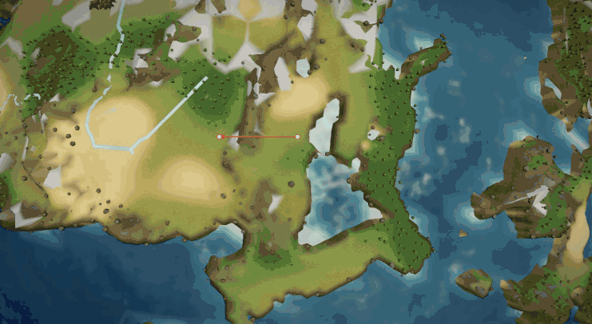
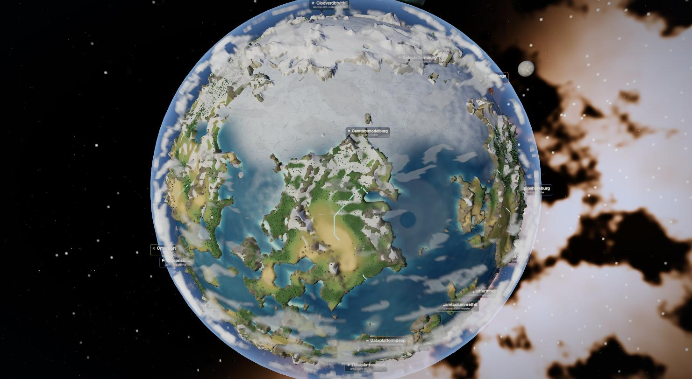

# Sekai 世界

**A living 3D world built from your Claude Code sessions.** Every session becomes a settlement, every piece of work a building, and the whole thing grows into a medieval × steampunk civilization on a hand-crafted planet — dragons, airships, weather, war, and all. Deterministic: the same sessions always rebuild the same world.


## What it is

Sekai reads your local Claude Code transcripts and renders them as a civilization. It runs entirely on your machine — a Vite web app in the browser, or a packaged desktop app. There is no database and no cloud: the transcript files *are* the persistence, and every position in the world is a pure function of `(seed, project path, session id)`. Point it at a different seed and you get a different, but equally deterministic, planet.

It's built on the 2026 web-3D stack — three.js's WebGPU renderer with TSL node materials — so the whole thing is real GPU shading: volumetric clouds, atmospheric scattering, a Gerstner ocean, rivers carved from an offline erosion bake.

## Features

### Terrain & ocean
- Procedural planet with fjord coastlines, archipelagos and dramatic relief (`planet.js`)
- Animated Gerstner **ocean** — rolling swell, crest whitecaps, breaking shore foam (`ocean.js`)
- **Rivers** traced from a committed CPU **erosion bake** (priority-flood + D8 flow accumulation), draped down the valleys as glowing water ribbons (`rivers.js`, `erosion.js`, `heightfield.js`)
- A **frozen sea** near the poles — the ocean surface itself freezes to matte cracked ice, its extent breathing with the season (`ocean.js`); polar snow line + hurricane-driven **coastal flooding** (`flood.js`)



### Sky & atmosphere
- Galaxy starfield with a fast-rotating **sun** — watch the terminator sweep and the dark side light up (`sky.js`)
- Physically-flavoured **atmospheric scattering** (`atmosphere.js`)
- **Volumetric clouds** and hurricanes with lit tops and shaded bellies (`clouds.js`)
- Aurora and eclipse events; sub-pixel output **dithering** so dark gradients never band


### Weather & life
- **Seasons** — a slow cycle that drives snow line, foliage tint, frozen-sea extent and daylight (`seasons.js`)
- Flocking **birds** (`birds.js`), breaching **whales & dolphins** (`sealife.js`), **fish schools** under the shallows (`fishschools.js`), migrating **wildlife herds** (`wildlife.js`)
- Poisson-scattered **forests** with contact shadows (`flora.js`), drifting **weather fronts** and precipitation (`weather.js`, `wind.js`)
- Procedural **ambient sound** — wind, ocean and distant activity (`ambient.js`)

### World-sim — sessions → civilization
- Each **session** becomes a settlement; each session's work becomes **buildings** sized to its activity (`world.js`, `buildings.js`)
- **NPC civilizations** fill the rest of the world with distinct archetypes, never overlapping your real settlements (`civsim.js`, `civrender.js`)
- Active **trade caravans** and **roads** between settlements (`caravans.js`, `roads.js`), cruising **airships** (`airships.js`), and a resident **dragon** with a mountain lair (`dragon.js`)
- The **Aemunis Herald** — a medieval chronicle ticker that narrates your real git activity (`herald.js`)
- Ancient **ruins** at seeded sites (`ruins.js`); commits become fireworks and merged PRs become monuments (`events.js`)




### Conflict & cataclysm
- **Raiding parties & field battles** — raider factions (tmp-dir projects) march on prosperous settlements; armies muster, clash, and leave banners + scorch that heal (`warsim.js`, `warrender.js`)
- Active **volcanoes** (`volcano.js`), **earthquakes** with camera shake (`earthquake.js`), and **meteor strikes** (`meteor.js`)
- **The Covenant:** simulation is *additive*. Conflict and cataclysm happen *around* your session structures — they leave marks and always heal — but never move, destroy, or overwrite the record of your work.


### Controls
Bottom-right cluster: 🎛 feature toggles · ⚡ god controls (meteor, hurricane, aurora, fast-sun) · zoom · 🔇 ambient mute · 🖼 poster export (high-res PNG) · 🎬 cinematic auto-tour. Click a settlement in the sidebar to inspect it or resume that Claude Code session in a terminal.

## Tech stack

| Layer | What |
|---|---|
| Renderer | **three.js r185 `WebGPURenderer`** (WebGL2 default, true WebGPU via `?renderer=webgpu`) |
| Shading | **TSL** node materials — one graph compiles to WGSL *and* GLSL. No `ShaderMaterial`/`onBeforeCompile` |
| Post | Node `PostProcessing` — atmosphere → volumetric clouds → bloom → dither |
| Build/dev | **Vite 8** with a middleware API server |
| Desktop | **Electron** + electron-builder → a signed-free `Sekai.app` running a bundled zero-dependency Node server |

## Run it

```bash
npm install

npm start        # browser at http://localhost:5173 (opens automatically)
npm run app      # desktop app (dev) — Electron window over the dev server
npm run dist     # package a double-clickable Sekai.app + .dmg into release/
```

URL params: `?seed=<name>` rebuilds a different deterministic world; `?renderer=webgpu` opts into the true-WebGPU backend. Requires Node 24 and a Chromium-based browser (WebGPU/WebGL2).

## How it works

Sekai scans `~/.claude/projects/**` for session transcripts and maps them to the world:

| Claude Code | Sekai |
|---|---|
| A project | A settlement (its race/style seeded from the project path) |
| A session | A building in that settlement |
| Session activity | Building count, size, and "agents at work" |
| A commit | A firework |
| A merged PR | A monument |
| A `tmp`/scratch project | A raider faction |
| Git merge conflicts | Border skirmishes between the rival factions |
| Session activity / prosperity | How attractive a settlement is to raid |
| A merged PR between rivals | A peace treaty |

Everything is seeded through `src/util.js` (`rngFromString`, `hash01`, `makeNoise3D`) — no `Math.random` or `Date.now` touches world state, so a world is fully reproducible from its inputs.

## Repository layout

`src/` is kept **flat** — ~37 modules wired together by `main.js` (the single integration point) and `world.js`. Conceptually they group as:

- **render/terrain** — `planet.js` `ocean.js` `rivers.js` `sky.js` `atmosphere.js` `clouds.js` `assets.js` `env.js`
- **world** — `world.js` `buildings.js` `placement.js` `labels.js` `civsim.js` `civrender.js` `caravans.js` `roads.js` `airships.js` `dragon.js` `ruins.js` `herald.js` `events.js`
- **sim/conflict** — `warsim.js` `warrender.js` `volcano.js` `earthquake.js` `meteor.js`
- **weather/life** — `weather.js` `wind.js` `storms.js` `flood.js` `sealife.js` `fishschools.js` `wildlife.js` `birds.js` `flora.js` `seasons.js` `trails.js` `ambient.js`
- **support** — `util.js` `ui.js` `cameraFeel.js` `poster.js` `autotour.js` `verifykit.js`
- **offline** — `terrainField.js` `erosion.js` `heightfield.js` + `scripts/bake-heightfield.mjs` (the deterministic erosion bake)
- **server/** — the zero-dependency local API (`scan.js` `gitinfo.js` `resume.js`, shared router `api.js`, standalone `server.js`)

## Status & roadmap

The graphics program is complete (M0–M5c) and the epilogue is shipped: rivers, seasons, fish schools, ruins, ambient sound, poster export, auto-tour, the packaged Electron app, and the full conflict ladder — raids & battles (rung 1), data-driven skirmishes / supply economy / sieges / treaties (rungs 2–3). A parallax-occlusion terrain-detail node (`pom.js`) is built and awaiting shader integration. See [DESIGN.md](DESIGN.md) for how it all fits together.

## Credits

Bundled art is CC0 / permissively licensed — see `public/textures/SOURCES.md` and `public/models/SOURCES.md` for per-asset attribution (ambientCG textures; Kenney and Quaternius model kits). Built on [three.js](https://threejs.org) and [simplex-noise](https://github.com/jwagner/simplex-noise.js).

## License

Sekai is licensed under the [Apache License 2.0](LICENSE) — you're free to use, modify, and redistribute it, with attribution and the license notice. Bundled art assets retain their own CC0/permissive licenses (see the `SOURCES.md` files); see [NOTICE](NOTICE) for attribution.
